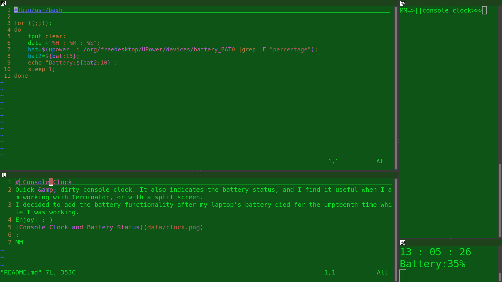

# Console_Clock
Quick &amp; dirty console clock. 
It also indicates the battery status, and I find it useful when I am working with Terminator, or with a split screen. 

I decided to add the battery functionality after my laptop's battery died on me for the umpteenth time while I was working.

Enjoy! :-)

MM
